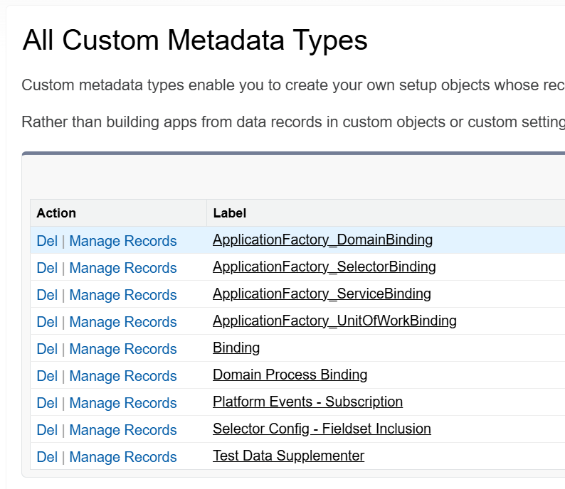
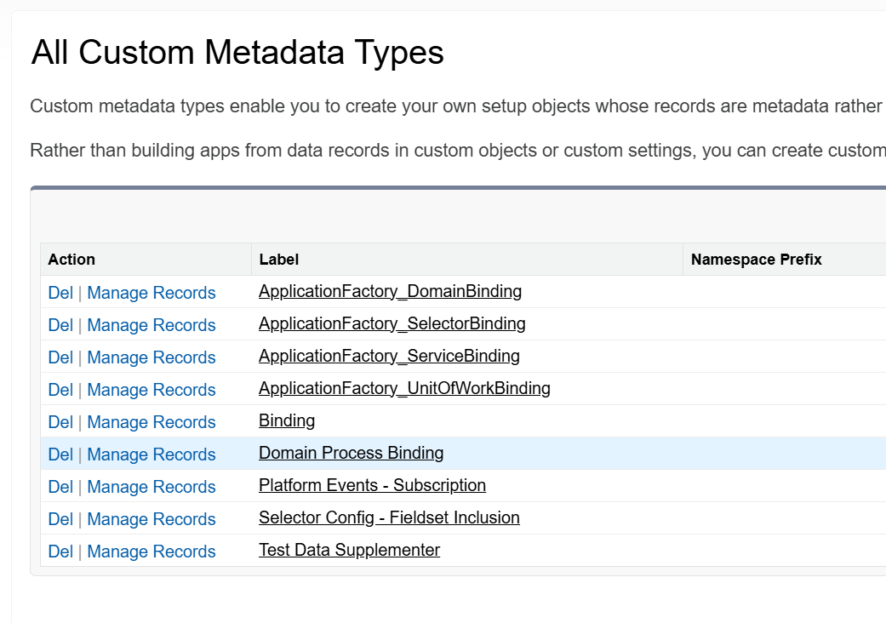

# DOMAIN LAYER SETUP

## Overview

The Domain Layer. This is where it gets convoluted and messy but hang in there with me and you will see why all this is necessary.

My Knowledge of the Domain Layer has evolved the most since I started learning about `fflib`. It started out as the home for Trigger logic where all Trigger-Specific Actions will be housed for each of the different types of Before and After Triggers, like SObject Validation or setting values on a related record. Then that logic moved to a Triggerhandler class as part of the Implementation Layer and was seperate from the Domain. Now Trigger logic has moved to **`Domain Process Actions`**.

So the **`Trigger`** calls the **`Domain`** which then gets all of its **`Domain Process Actions`** and then, for each **`Trigger Operation`** (Before Insert, After Update, etc), cycles through all of the Active Actions for that SObject based on the **`Trigger Operation`** indicated on the **`Custom Metadata Type`** Record for the Action.

Simple, right?

There a lot of Benefits to doing it this way:
1. Much more control over if that specific trigger logic piece should be enabled or disabled WITHOUT having to do deploy Apex changes.
1. Control over the order in which the Trigger Logic fires again WITHOUT having to do deploy Apex changes.
1. Testing of Trigger Logic can be compartmentalized to just that individual use case without have to worry about outside record manipluation, data validation, or DML issues.    

## How to Create a Trigger and Domain using `fflib` and `at4dx`

1. [Create Domain Interface](#create-domain-interface)
1. [Create Domain Class](#create-domain-class)
1. [Create Trigger](#create-trigger)
1. [Add `ApplicationFactory_DomainBinding` MDT Record](#add-applicationfactory_domainbinding-mdt-record)
1. [Create Domain Process Action Class](#create-domain-process-action-class)
1. [Add `Domain Process Binding` MDT Record](#add-domain-process-binding-mdt-record)
1. [Create Test Class](#create-test-class)
---
### Create Domain Interface
---
Extend `IApplicationSObjectDomain` which extends `fflib_ISObjectDomain` which extends `fflib_ISObjects` which extends `fflib_IObjects`.

(For only `fflib` we need only extend `fflib_ISObjects`)

Any Domain-specific methods should go here (Uncommon).

Common naming convention is to just pluralize the name of the SObject (i.e. **MySObjects**) though some like to add '**Domain**' to the end for clarity (example: **MySObjectsDomain**).

#### Domain Interface Template
```
public interface IMySObjects extends fflib_ISObjectDomain {
    //Any Additional Methods specific to the MySObjects Domain should go here
}
```
[(Back to Top)](#how-to-create-a-trigger-and-domain-using-fflib-and-at4dx)

---

### Create Domain Class
---
Extend the `ApplicationSObjectDomain` and implement the newly created Interface create in the last step.

The only thing that needs to be included is a simple constructor and an internal class called **Constructor** that implements the `fflib_SObjectDomain.IConstructable` Interface. This class should only have one method inside it called **construct**.

#### Domain Template
```
public class MySObjectDomain extends ApplicationSObjectDomain implements IMySObjects {

    public MySObjects(List<MySObject__c> sObjectList) {
        super(sObjectList);
    }

    public List<MySObject__c> getMySObjectRecords()
	{
		return (List<MySObject__c>) getRecords();
	}

    //Additional Domain Methods Here (if any)

    //Required. Domain and Domain Actions will fail without this piece
    public class Constructor implements fflib_SObjectDomain.IConstructable {
        public fflib_SObjectDomain construct(List<Object> objectList) {
            return new MySObjects((List<SObject>) objectList);
        }
    }
}
```
[(Back to Top)](#how-to-create-a-trigger-and-domain-using-fflib-and-at4dx)

---
### Create Trigger
---
Creation of the Trigger is extermely straight-forward and does not require any additional logic or alterations.

#### Trigger Template
```
trigger MySObjectTrigger on MySObject__c (after delete, after insert, after update, before delete, before insert, before update) {
    fflib_SObjectDomain.triggerHandler(MySObjects.class);
}
```
[(Back to Top)](#how-to-create-a-trigger-and-domain-using-fflib-and-at4dx)

---
### Add `ApplicationFactory_DomainBinding` MDT Record
---
1. Navigate to **Setup** > **Custom Metadata Types**
1. Click **Manage Records** next to **`ApplicationFactory_DomainBinding`**    
    
1. Click **New** and Create a New Record using the following values:
    | Field | Value |
    | - | - | 
    |**Label**: | MySObject |
    |**ApplicationFactory_DomainBinding Name**: | [Default] |
    |**Binding SObject**: | MySObject |
    |**To**: | MySObjects.Constructor |
    |**Binding SObject Alternate**: | [Leave Blank] |

[(Back to Top)](#how-to-create-a-trigger-and-domain-using-fflib-and-at4dx)

---
### Create Domain Process Action Class
---
Extend the `DomainProcessAbstractAction` Class which implements `IDomainProcessAction` among others.

If the Action is going to use Exisitng Records (Like `After Update` or `After Insert`) it needs to implement the `IDomainProcessActionWithExistingRecs` Interface otherwise no addtitional interface is needed.

#### Domain Process Action (with Existing Records) Template
```
public inherited sharing class MyExampleActionAfterAction extends DomainProcessAbstractAction implements IDomainProcessActionWithExistingRecs {


    private Map<Id, SObject> existingRecords = new Map<Id, SObject>();

    //Method Required by IDomainProcessActionWithExistingRecs interface
    public IDomainProcessAction setExistingRecords(Map<Id, SObject> existingRecords){
        if(existingRecords != null && !existingRecords.isEmpty()){
            this.existingRecords = existingRecords;
        }
        return this;
    }

    //Overrides the Abstract Action in the DomainProcessAbstractAction Class
    //This is where the method's work will be performed
    public override void runInProcess(){

        //Get records from Trigger Operation
        List<MySObjects__c> records = (List<MySObjects__c>) this.records;

        //Do Work add any DML changes to this.uow (if needed)

        //Commit changes, (if needed)
        this.uow.commitWork();
    }
}
```

[(Back to Top)](#how-to-create-a-trigger-and-domain-using-fflib-and-at4dx)

---
### Add `Domain Process Binding` MDT Record
---
You will need to create an MDT Record for each Trigger Execution Timing you desire (i.e. `After Insert`, `After Update`).

There are a few setting options like **Prevent Recursive** and **Execute Asynchronous** that might want to be considered. Review the tool tips for further help on these settings.
---
1. Navigate to **Setup** > **Custom Metadata Types**
1. Click **Manage Records** next to **`Domain Process Binding`**    
    
1. Click **New** and Create a New Record using the following values:
    | Field | Value |
    | - | - | 
    |**Label**: | MySObject |
    |**Domain Process Binding Name**: | [Default] |
    |**Is Active**: | True (Default) |
    |**Process Context**: | Trigger Execution (Default) |
    |**Type**: | Action |
    |**Related Domain SObject Binding**: | MySObject |
    |**Related Domain Binding SObject Alternate**: | [Leave Blank] |
    |**Domain Method Token**: | [Leave Blank] |
    |**Trigger Operation**: | [Your Desired Trigger] |
    |**Class To Inject**: | MyExampleActionAfterAction |
    |**Prevent Recursive**: | Run only once? |
    |**Logical Inverse**: | [Leave Blank] |
    |**Description**: | Enter a Description of your Action |
    |**Execute Asynchronous**: | Run as Queueable? |

[(Back to Top)](#how-to-create-a-trigger-and-domain-using-fflib-and-at4dx)

---
### Create Test Class
---
1. Create Test Class for Domain
    1. Create Unit Test Methods for Domain
    1. Use Asserts to Validate Results

#### Domain Test Class Template
```
@IsTest
public class MySObjectsTest {
       
    // Call newInstance
    @IsTest
    public static void givenRecord_WhenNewInstanceCalled_ThenReturnInstance() {

        MySObject__c testRecord = new MySObject__c();
        Test.startTest();
        IMySObjects result = IMySObjects.newInstance(new List<MySObject__c>{testRecord});
        Test.stopTest();

        Assert.areNotEqual(null, result, 'Should return instance');
    }

    // Call Constructor
    @isTest
    public static void givenListOfRecords_WhenConstructorClassCalled_ThenReturnsCorrectNumberOfRecords(){
        List<MySObject__c> records = new List<MySObject__c>{new MySObject__c()};
        MySObjects.Constructor constructor = new MySObjects.Constructor();
        MySObjects domain = (MySObjects) constructor.construct(records);
        
        Assert.areEqual(records.size(), domain.getMySObjectRecords().size(), 'Number of Records Match');
    } 
}
```

#### Domain Action Test Class Template
```
TBD
```
[(Back to Top)](#how-to-create-a-trigger-and-domain-using-fflib-and-at4dx)

---
