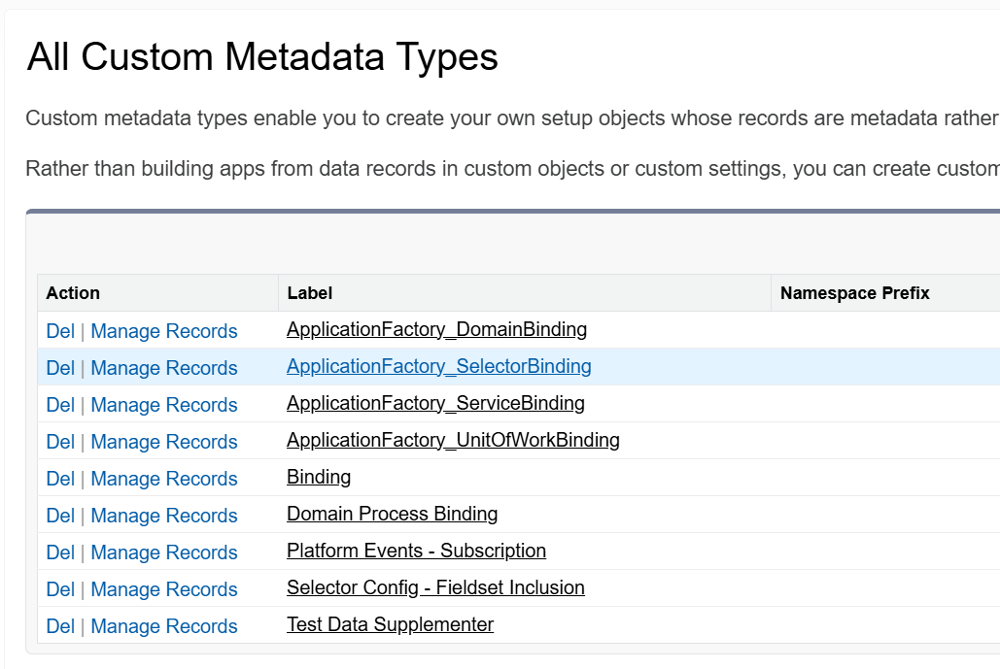
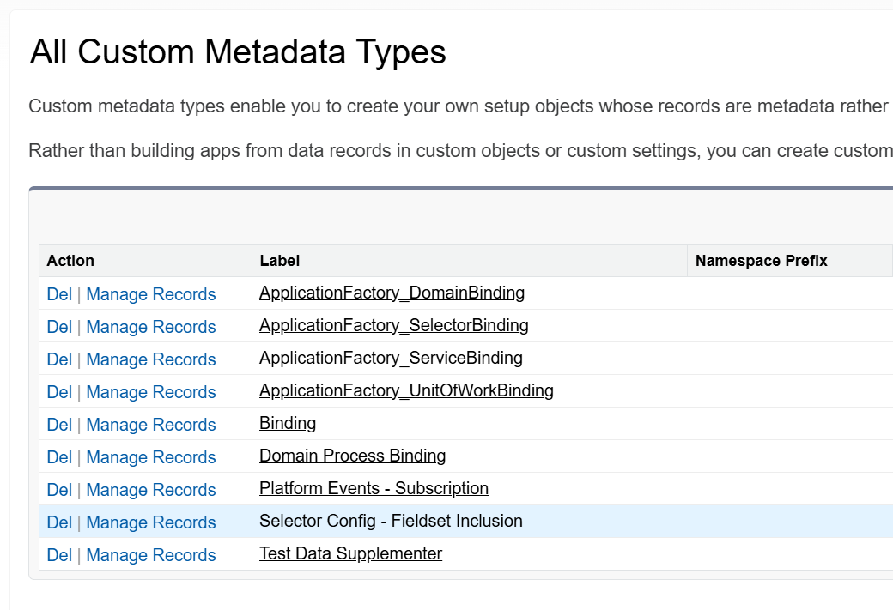

# SELECTOR LAYER SETUP

## Overview

The Selector Layer is very simple and stright forward. Wherever any and all SOQL calls need to be made, we will use a Selector instead. This way it keeps all of the queries for an SObject in one place.

It is also useful when writing Test Classes as this Layer can then be Mocked and Stubbed out from the whatever Test Class is calling the Selector to return relevant results without having to actually perform any DML with Test Data. This will allow us to bypass any unneeded data manipulation required by Validation Rules as well as unexpected results from Triggers on the SObject that might change the data on the Test Record. Unit test data can then focus on just the logic in the method without having to worry about any Data Manipulation or Validation Rules that might be applied now or in the future.

---

## How to Create a Selector using `fflib` and `at4dx`
1. [Create Selector Interface](#create-selector-interface)
1. [Create Selector Class](#create-selector-class)
1. [Add Required Methods from Interface](#add-required-methods-from-interface)
1. [Add Methods for Different SOQL Calls](#add-methods-for-different-soql-calls)
1. [Add `Application Factory Selector Binding` MDT Record](#create-application-factory-selector-binding-record)
1. [Create FieldSet for SObject](#create-fieldset-for-sobject)
1. [Add `FieldSet Selector Binding` MDT Record](#create-selector-config---field-set-inclusion-record)
1. [Create Test Class](#create-test-class)
---
### Create Selector Interface 
Extend `IApplicationSObjectSelector` which extends `fflib_ISObjectSelector`.

(For only `fflib` we need only extend `fflib_ISObjectSelector`)

#### Interface Template
```
public interface IMySObjectSelector extends IApplicationSObjectSelector {
    //Additional SOQL Methods Go Here
    List<MySObject__c> selectByRelatedRecordIdExample(Set<Id> relatedIds);
}
```
[Back to Top](#how-to-create-a-selector-using-fflib-and-at4dx)

---
### Create Selector Class
Extend the `ApplicationSObjectSelector` Class and implement the newly created Interface create in the last step.

**NOTE**: By default, Selectors using `at4dx` automatically include all standard fields as well as all FieldSets including in the `Selector Config - Field Set Inclusion` Custom Metadata Record (We will create this in the last step).

#### Selector Template
```
public without sharing class MySObjectSelector extends ApplicationSObjectSelector implements IMySObjectSelector {

    // Required Methods Go Here

    // Additional Methods Go Here

}
```
[Back to Top](#how-to-create-a-selector-using-fflib-and-at4dx)

---
### Add Required Methods from Interface

#### Required SOQL Method Template
```
    //Required Method to Determine SObject Type
    public Schema.SObjectType getSObjectType() {
        return MySObject__c.SObjectType;
    }

    //Required Method to get any Additional Fields from SObject
    public List<Schema.SObjectField> getAdditionalSObjectFieldList() {
        return new List<Schema.SObjectField> {
            //Additional Fields Go Here
        };
    }
    
    //Standard Method. Basic Select By ID Query (From Grand Parent: fflib_SObjectSelector)
    public List<MySObject__c> selectById(Set<Id> recordIds){
        // If customization is needed like adding related fields, 
        // Replace this line with a standard QueryFactory Setup
        return super.selectSObjectsById(recordIds);
    }
```
[Back to Top](#how-to-create-a-selector-using-fflib-and-at4dx)

---
### Add Methods for Different SOQL Calls

1. Each Method should return a List of the SObject[^bulkReturn]
1. Each Method should accept Sets of parameter values[^bulkInputs]
1. Each Method's name should reflect the ***Where*** Condition of the SOQL call
1. Methods should *NOT* contain any logic
1. All new methods should also be added to the Interface for Mocking and Stubbing

#### Additonal SOQL Method Template
```
    //Additional Methods
    public List<MySObject__c> selectByRelatedRecordIdExample(Set<Id> relatedIds){
        fflib_QueryFactory query = newQueryFactory();
        query.setCondition('Related__c = :relatedIds');
        return (List<MySObject__c>) Database.query(query.toSOQL());
    }
```

[^bulkReturn]: Selector Methods should Return Lists of the SObject Type not just an individual SObject for bulkification and possible resuability later. 

[^bulkInputs]: Parameters for Selector Methods should always be Sets or Lists for bulkification and possible resuability later.

#### Query Factory Options

##### Initialize QueryFactory:

1. **AssertCRUD**: (Optional) **False** By Default, Determines if CRUD Permissions are Enforced.
1. **EnforceFLS**: (Optional) **False** By Default, Determines if Field Level Secrity is Enforced.
1. **IncludeSelectorFields**: (Optional) **True** By Default, Query Uses Fields from getSObjectFieldList Method. Disable to limit to only own selected fields

```
fflib_QueryFactory query = newQueryFactory(AssertCRUD, EnforceFLS, IncludeSelectorFields);
```

##### Add Additional Related Fields:
```
//Add Specific Fields
query.selectField('Related__r.Name');

// AND / OR 

//Add All Fields from Related Object's Selector
new myRelatedSObjectSelector().addQueryFactorySubselect(query, 'Related__r');
```
##### Set Where Clause:
```
// Can only be added once so include ALL conditions in the String at once
query.setCondition('ID in :setIds AND isActive = true'); 

// OR

List<String> conditions = new List<String>{
    'ID in :setIds',
    'IsActive = true',
    'Related__c != NULL'
}
query.setCondition(String.join(conditions, ' AND '));
```

##### Set Order and Limit
```
//Sort Results (Field Name, Sort Order, NullsLast)
query.addOrdering('Name', fflib_QueryFactory.SortOrder.ASCENDING, true) 

//Limit Results
query.setLimit(10); 
```
There are more options than those listed above but these are the most common

[Back to Top](#how-to-create-a-selector-using-fflib-and-at4dx)

---
### Create `Application Factory Selector Binding` Record
---
1. Navigate to **Setup** > **Custom Metadata Types**
1. Click **Manage Records** next to **`ApplicationFactory_SelectorBinding`**    
    
1. Click **New** and Create a New Record using the following values:
    | Field | Value |
    | - | - | 
    |**Label**: | MySObject |
    |**ApplicationFactory_SelectorBinding Name**: | [Default] |
    |**Binding SObject**: | MySObject |
    |**To**: | MySObjectSelector |
    |**Binding SObject Alternate**: | [Leave Blank] |
    |**Priority**: | [Leave Blank] |
[Back to Top](#how-to-create-a-selector-using-fflib-and-at4dx)

---
### Create `FieldSet` for SObject
---
1. Navigate to **Setup** > **Object Manager** 
1. Find **MySObject**
1. Open **Field Sets** and Click **New**
    | Field | Value |
    | - | - | 
    |**Field Set Label**: | MySObjectSelector Field Set |
    |**Field Set Name**: | [Default] |
    |**Where is this used?**: | "In Selector Config for this SObject" |
1. Click **Save**
1. Drag and Drop all fields you want the **Selector** to include into the **Field Set**
1. Click **Save**

[Back to Top](#how-to-create-a-selector-using-fflib-and-at4dx)

---
### Create `Selector Config - Field Set Inclusion` Record
---
1. Navigate to **Setup** > **Custom Metadata Types**
1. Click **Manage Records** next to **`Selector Config - Fieldset Inclusion`**    
    
1. Click **New** and Create a New Record using the following values:
    | Field | Value |
    | - | - | 
    |**Label**: | MySObjectSelector Field Set |
    |**Selector Config - Fieldset Inclusion Name**: | [Default] |
    |**Binding SObject**: | MySObject |
    |**Fieldset Name**: | [Name of Field Set created in the Last Step]|
    |**Binding SObject Alternate**: | [Leave Blank] |
[Back to Top](#how-to-create-a-selector-using-fflib-and-at4dx)

---
### Create Test Class
---
1. Create and Insert Setup Data using Test Utility Class [^testData]
1. Create Test Methods for Selector Method
1. Use Asserts or [Mocks.Verify()](/documentation/Mocks.Verify-Examples.md) Methods to Validate Results

[^testData]: This should be the only time you will need to manipulate and insert test data

#### Selector Test Template
```
@isTest
private class MySObjectSelectorTest {
    
    @isTest
    public static void givenId_WhenSelectByIdIsCalled_ThenReturnCorrectRecord() {
        
        //Create Test Data (Use Test Util Class where possible)
        MySObject__c testRecord = TestUtil.createMySObject();
        insert testRecord; 

        //Perform Test
        Test.startTest();
        MySObjectSelector selector = Application.Selector.newInstance(MySObject__c.SObjectType);
        List<MySObject__c> results = MySObjectSelector.newInstance().selectById(new Set<Id>{testRecord.Id});
        Test.stopTest();

        //Validate Data
        Assert.areEqual(1, results.size(), 'No Results Returned for Test Record ID');
        Assert.areEqual(testRecord.Id, results[0].Id, 'Record Returned does not match Test Record');
    }

    //Additional Test Methods for Selector Methods
    
}
```
[Back to Top](#how-to-create-a-selector-using-fflib-and-at4dx)

---