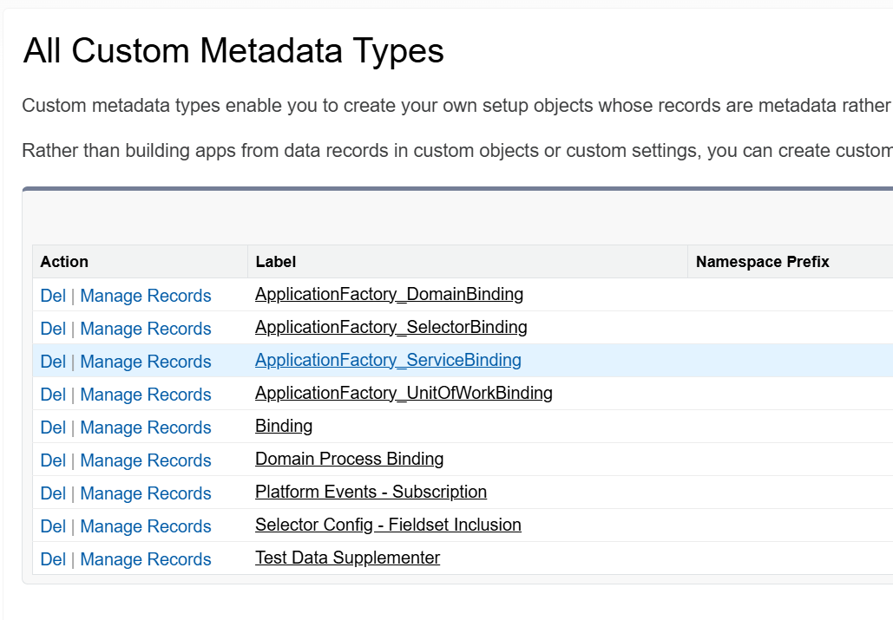

# SERVICE LAYER SETUP

## Overview

The Service Layer is the Meat and Potatoes of the Apex Methods. This is where most of all of the complex logic should be performed for an SObject. [Controllers](), [Domains](), and (more often) [Domain Actions]() should call the method from the [Service]() Layer. 

Service Methods would then call the [Selector]() to make a SOQL call to retrieve related records, or even other Services to perform actions or logic not related to its SObject.

For each Service Method that performs any DML, the method should accept a [Unit of Work]() Object as a parameter from the source that calls it. The source (be it [Domain](), [Domain Action](), or [Controller]()) should initialize the [Unit of Work]() and then commit the records AFTER the call to all Service methods.

Because no actual DML is being performed yet, the **`Register`**, **`RegisterNew`**, and **`RegisterDirty`** Methods from the [Unit of Work]() CAN be done inside of Loops without any issue of hitting Governor Limits. 

The Benefit is that this Layer can then Mock and Stub out those other [Services](), [Selectors](), and the [UnitOfWork](). In doing so, Test data can be created and limited to just the fields and values required by the logic of the Service Unit Test and not have to worry about any additional validation rules or required fields of the record as no SOQL calls or DML will actually be performed in the Unit Tests.

## How to Create a Service using `fflib` and `at4dx`
1. Create Service Interface
1. Create Service Class
1. Add `Application Factory Service Binding` MDT Record
1. Add Methods for Individual Features
    1. Pass in [UnitOfWork]() from [Implementation Layer]() (i.e. [Trigger Handler](/force-app/main/default/classes/FFLIB%20Examples/TriggerHandlers) or an [Apex Controller](/force-app/main/default/classes/FFLIB%20Examples/Controllers))
    1. Call [Selectors](/force-app/main/default/classes/FFLIB%20Examples/Selectors) for any SOQL Calls Needed 
    1. Call [Domain](/force-app/main/default/classes/FFLIB%20Examples/Domains) for any record filtering or processing
    1. Register All DMLs needed into passed in [UnitOfWork]() Object

---
### Create Service Interface
---
Service Interfaces are extremely simple: just add method signature for any Service Methods you create.
Thats it. 
#### Service Interface Template
```
public interface IMySObjectService {
    //Service Methods Go Here
}
```
[Back to Top](#how-to-create-a-service-using-fflib-and-at4dx)

---

### Create Service Class
---
When creating your Service Class, there are a few things that should be kept in consideration:
1. Make sure that you implement the Interface you just created 
1. Set sharing for the class to `inherited`
1. Variables should be `@TestVisible private static`. This includes:
    1. Simple Varables like `Booleans` or `Numbers` 
    1. External classes like [Selectors]() or other [Services]()
    1. Error Messages stored as `final` Strings [^finalStrings].

#### Service Class Template
```
public inherited sharing class MySObjectService implements IMySObjectService {
    
    //Set Variables, Services, and Selectors used throughout this Service

    //Set Static Error Messages
    @TestVisible private static final String NO_RECORD_ID_ERR_MSG = 'Invalid ID';


    public void myMethod(fflib_SObjectUnitOfWork uow, Id recordId){

        //Validate Inputs
        if(recordId == null){
            throw new MySObjectServiceException(NO_RECORD_ID_ERR_MSG);
        }

        // Do Work
    }

    public class MySObjectServiceException extends Exception {}
}
```
[^finalStrings]: Setting things like Error Messages, Record Type Names, or values unlikely to change as `@TestVisible private static final` Strings allows us to use these variables when validating our tests results without have to worry about breaking our tests if the string value (most commonly, error messages) need to be altered later. 

[Back to Top](#how-to-create-a-service-using-fflib-and-at4dx)

---
### Create `Application Factory Service Binding` Record
---
1. Navigate to **Setup** > **Custom Metadata Types**
1. Click **Manage Records** next to **`ApplicationFactory_SelectorBinding`**    
    
1. Click **New** and Create a New Record using the following values:
    | Field | Value |
    | - | - | 
    |**Label**: | MySObject |
    |**ApplicationFactory_ServiceBinding Name**: | [Default] |
    |**Binding SObject**: | MySObject |
    |**To**: | MySObjectSelector |
    |**Binding SObject Alternate**: | [Leave Blank] |
    |**Priority**: | [Leave Blank] |

[Back to Top](#how-to-create-a-service-using-fflib-and-at4dx)

---### Test Class
1. Add Mocking & Stubbing for any [Selectors]() Used
1. Add Mocking & Stubbing for [UnitOfWork]()
1. Create Test Methods for Every Possible Scenario for Feature NOT Just Code Coverage
    1. Happy Path
    1. Negative Paths
    1. Alternative Paths
    1. Bulkified Records
1. Use Asserts or [Mocks.Verify()](/documentation/Mocks.Verify-Examples.md) Methods to Validate Results

#### Service Test Class Template
**NOTE**: [MockSetup Class Template](/documentation/MockSetup-Class#8-final-product)
```
@isTest
private class MySObjectServiceTest {
    //#region MockSetup
    // MockSetup Class Template Goes Here
    //#endregion

    //Test Plan
    // Call Service using Current Config Record
    // Call MyMethod with Custom Config where Service Disabled
    // List of Additional Unit Tests Go Here

    //Start Testing

    //#region /////////////////// MyMethodExample ///////////////////////////////
    // Call MyMethodExample with Custom Config where Service Disabled
    @IsTest
    public static void givenInvalidInputsForService_WhenMyMethodIsCalled_ThenErrorThrown(){

        //Setup Test Data and Mocking
        //Setup Return Values
        Map<MockParams, Object> params = new Map<MockParams, Object>();

        //Initialize MockSetup with Params 
        MockSetup mock = new MockSetup(params);
        
        //Run Test
        Test.startTest();
        String errMessage = 'No Error Found';
        MySObjectService service = new MySObjectService();
        try{
            //Pass mocked Unit Of Work and Mocked Record ID
            service.myMethodExample(mock.uowMock, fflib_IDGenerator.generate(MySObject__c.SObjectType));            
        Assert.isTrue(false, 'Error Not Thrown');
        } catch (Exception ex){
            errMessage = ex.getMessage();
        }
        Test.stopTest();

        //Validate Data
        Assert.areEqual(service.CUSTOM_ERROR_MESSAGE, errMessage, 'Error Message Does Not Match: '+ errMessage);
    }
    //Additional MyMethod Tests Go Here
    //#endregion
    
    //#region /////////////////// MyNextMethodExample ///////////////////////////////
    //Tests for MyNextMethodExample Method Go Here
    //#endregion

}
```
[Back to Top](#how-to-create-a-service-using-fflib-and-at4dx)

---